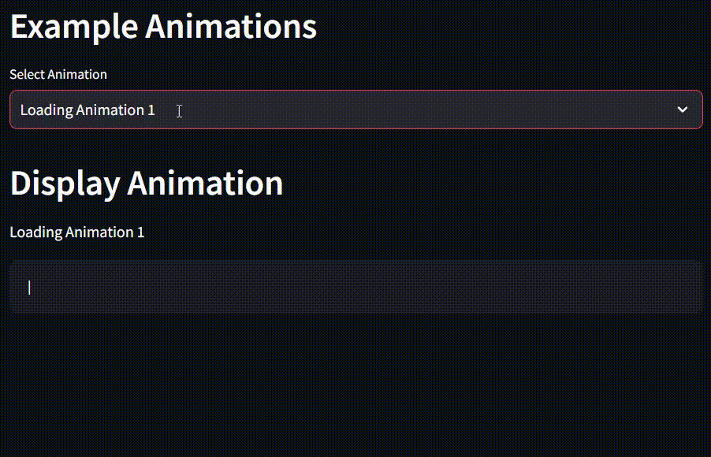
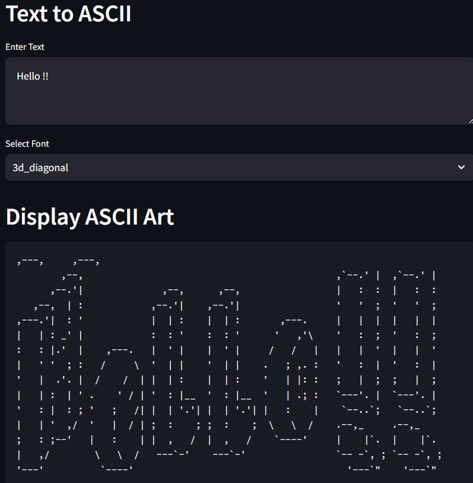
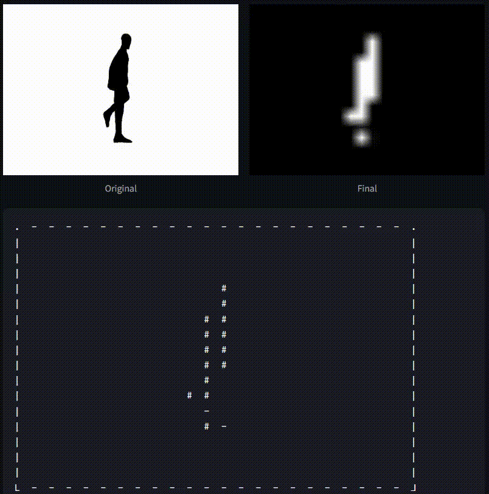

# AnimASCII
 A tool to generate and view ASCII Animations and pictures using images, text, sounds and more!

# GUI

- GUI built using streamlit
- To use app locally,
    - Clone the repo and run [run.sh](run.sh) to view the app on your browser!
- App is hosted at [Streamlit](https://kausikn-animascii.streamlit.app/)
- App can also be run on my [Common Host App](https://kausikn-commonhostapp.streamlit.app/),
    - Choose settings from the left tab dropdown and select "Add New Repo" under Select Setting dropdown
    - Type the repo name and click on "Add Repo"
    - Goto Choose Project from the left tab dropdown, choose the project and click load and deploy.
    - Then go ahead and use the app! 😃
    - If you want to change to another app, simply click on View Other Projects in top left and choose any other project and load and deploy.

# Example ASCII Animations

# Text to ASCII

# Image to ASCII

# Video to ASCII
